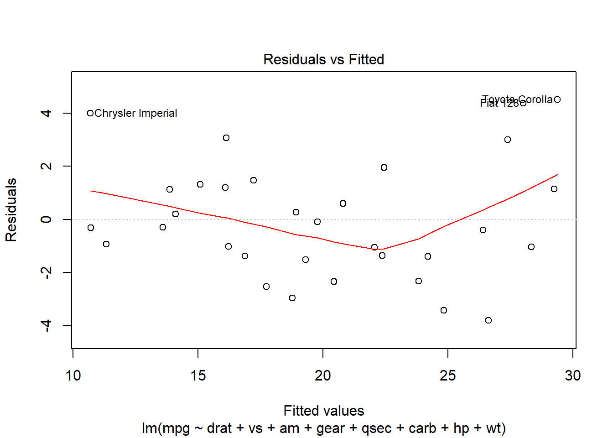
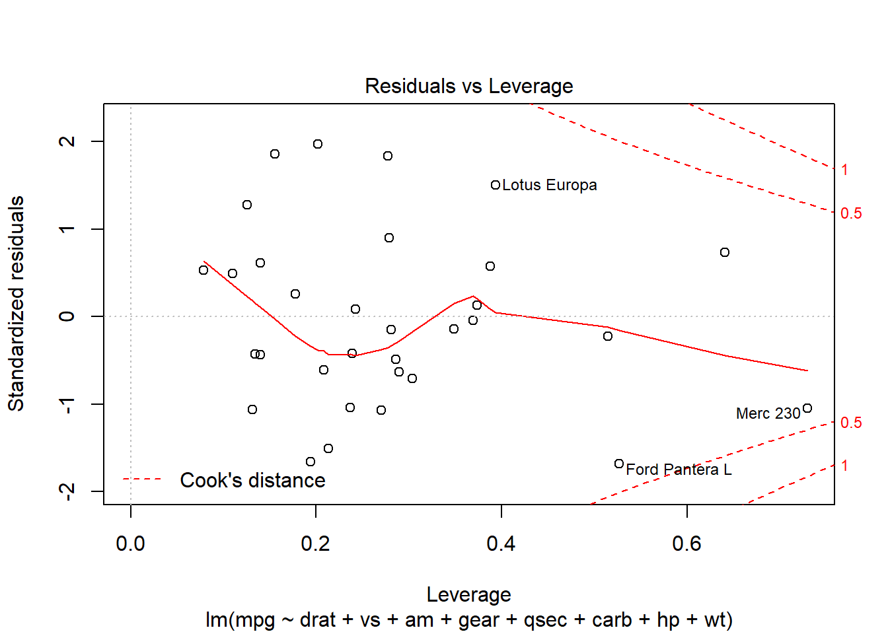
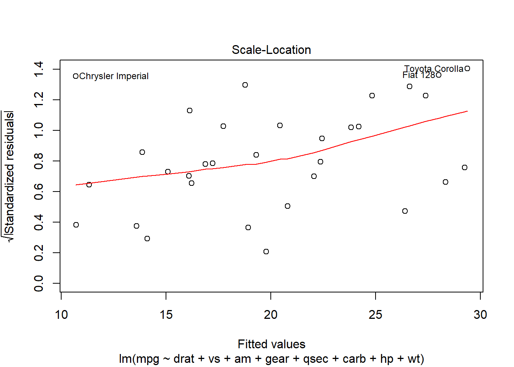

<!DOCTYPE html>

<html xmlns="http://www.w3.org/1999/xhtml">

<head>

<meta charset="utf-8" />

<meta http-equiv="Content-Type" content="text/html; charset=utf-8" />

<meta name="generator" content="pandoc" />

</head>

<body>

<!-- code folding -->

<h1 class="title toc-ignore">Regression Analysis in Motor Trend Car Road Tests</h1>

<h4 class="date"><em>November 1, 2018</em></h4>

<h2>Executive Summary</h2>

In this analysis, the researcher has investigated which is better for transmission - automatic or manual and the difference between the two. This analysis is based from the 1974 the Motor Trend Car Road Tests and comprises of fuel consumption and 10 aspects of automobile design and performance for 32 automobiles (1973 - 1974 models). The analysis will go through the following: discussion and presentation of descriptive statistics, conducting the initial regression model, diagnostic tests for the initial regression model (tests conducted are: test for multicollinearity, test for heteroskedasticity, and test for overfitting/underfitting), and presentation of the final model along with conclusions. The result of the analysis showed that manual transmission is better than automatic transmission.

<h2>Descriptive Statistics</h2>

Our dataset, mtcars is composed of 32 observations and 11 variables. A summary information about the data is illustrated showing the min values, max values, and values at 1st quarter, 3rd quarter, and median.

<pre class="r"><code>summary(mtcars)</code></pre>

<pre><code>##       mpg             cyl             disp             hp       

##  Min.   :10.40   Min.   :4.000   Min.   : 71.1   Min.   : 52.0  

##  1st Qu.:15.43   1st Qu.:4.000   1st Qu.:120.8   1st Qu.: 96.5  

##  Median :19.20   Median :6.000   Median :196.3   Median :123.0  

##  Mean   :20.09   Mean   :6.188   Mean   :230.7   Mean   :146.7  

##  3rd Qu.:22.80   3rd Qu.:8.000   3rd Qu.:326.0   3rd Qu.:180.0  

##  Max.   :33.90   Max.   :8.000   Max.   :472.0   Max.   :335.0  

##       drat             wt             qsec             vs        

##  Min.   :2.760   Min.   :1.513   Min.   :14.50   Min.   :0.0000  

##  1st Qu.:3.080   1st Qu.:2.581   1st Qu.:16.89   1st Qu.:0.0000  

##  Median :3.695   Median :3.325   Median :17.71   Median :0.0000  

##  Mean   :3.597   Mean   :3.217   Mean   :17.85   Mean   :0.4375  

##  3rd Qu.:3.920   3rd Qu.:3.610   3rd Qu.:18.90   3rd Qu.:1.0000  

##  Max.   :4.930   Max.   :5.424   Max.   :22.90   Max.   :1.0000  

##        am              gear            carb      

##  Min.   :0.0000   Min.   :3.000   Min.   :1.000  

##  1st Qu.:0.0000   1st Qu.:3.000   1st Qu.:2.000  

##  Median :0.0000   Median :4.000   Median :2.000  

##  Mean   :0.4062   Mean   :3.688   Mean   :2.812  

##  3rd Qu.:1.0000   3rd Qu.:4.000   3rd Qu.:4.000  

##  Max.   :1.0000   Max.   :5.000   Max.   :8.000</code></pre>

It can be observed that variables, vs and am which are discrete has a mean below the 50th percentile. This tells that most of the observations have discrete values 0. Other variables aside from the mentioned earlier are continuous.

<h2>Initial Modelling</h2>

The initial regression model would include variable, mpg (miles per gallon) as our dependent variable and the rest of other variables as our independent variables. A diagnotic tests will follow after the initial modelling.

<pre class="r"><code>fit0 &lt;- lm(mpg ~., mtcars )

summary(fit0)</code></pre>

<pre><code>## 

## Call:

## lm(formula = mpg ~ ., data = mtcars)

## 

## Residuals:

##     Min      1Q  Median      3Q     Max 

## -3.4506 -1.6044 -0.1196  1.2193  4.6271 

## 

## Coefficients:

##             Estimate Std. Error t value Pr(&gt;|t|)  

## (Intercept) 12.30337   18.71788   0.657   0.5181  

## cyl         -0.11144    1.04502  -0.107   0.9161  

## disp         0.01334    0.01786   0.747   0.4635  

## hp          -0.02148    0.02177  -0.987   0.3350  

## drat         0.78711    1.63537   0.481   0.6353  

## wt          -3.71530    1.89441  -1.961   0.0633 .

## qsec         0.82104    0.73084   1.123   0.2739  

## vs           0.31776    2.10451   0.151   0.8814  

## am           2.52023    2.05665   1.225   0.2340  

## gear         0.65541    1.49326   0.439   0.6652  

## carb        -0.19942    0.82875  -0.241   0.8122  

## ---

## Signif. codes:  0 '***' 0.001 '**' 0.01 '*' 0.05 '.' 0.1 ' ' 1

## 

## Residual standard error: 2.65 on 21 degrees of freedom

## Multiple R-squared:  0.869,  Adjusted R-squared:  0.8066 

## F-statistic: 13.93 on 10 and 21 DF,  p-value: 3.793e-07</code></pre>

Based on the initial regression, the variables, cyl (number of cylinder), hp (gross horsepower), wt (weight in 1000 lbs), and carb (number of carburetors) have negative estimated coefficients. This tells a negative relationship to our dependent variable. Our adjusted R-squared is 80.66%. This tells that the variation in our model is explained by 80.66%. This is considered to be a good indicator that our model is good and able to explain our dependent variable.

<h2>Diagnostics</h2>

To get the final model, a series of diagnostic tests is conducted. This tests include: test for heteroskedasticity, variance inflation factor, and test for overfitting/underfitting.

<h3>Variance Inflation Factor</h3>

Under this test, the researcher has tested the model for any potential variance inflation factor. Variance inflation factor tells if the variance of an explanatory variable is inflated due to the high correlation to other explanatory variable(s). The goal in this test is to check our model for multicollinearity and to remove variables which have high variance inflation factor.

In the next figure, the researcher has presented the correlation table of the model.

<pre class="r"><code># Perform correlation

      cor(mtcars)</code></pre>

<pre><code>##             mpg        cyl       disp         hp        drat         wt

## mpg   1.0000000 -0.8521620 -0.8475514 -0.7761684  0.68117191 -0.8676594

## cyl  -0.8521620  1.0000000  0.9020329  0.8324475 -0.69993811  0.7824958

## disp -0.8475514  0.9020329  1.0000000  0.7909486 -0.71021393  0.8879799

## hp   -0.7761684  0.8324475  0.7909486  1.0000000 -0.44875912  0.6587479

## drat  0.6811719 -0.6999381 -0.7102139 -0.4487591  1.00000000 -0.7124406

## wt   -0.8676594  0.7824958  0.8879799  0.6587479 -0.71244065  1.0000000

## qsec  0.4186840 -0.5912421 -0.4336979 -0.7082234  0.09120476 -0.1747159

## vs    0.6640389 -0.8108118 -0.7104159 -0.7230967  0.44027846 -0.5549157

## am    0.5998324 -0.5226070 -0.5912270 -0.2432043  0.71271113 -0.6924953

## gear  0.4802848 -0.4926866 -0.5555692 -0.1257043  0.69961013 -0.5832870

## carb -0.5509251  0.5269883  0.3949769  0.7498125 -0.09078980  0.4276059

##             qsec         vs          am       gear        carb

## mpg   0.41868403  0.6640389  0.59983243  0.4802848 -0.55092507

## cyl  -0.59124207 -0.8108118 -0.52260705 -0.4926866  0.52698829

## disp -0.43369788 -0.7104159 -0.59122704 -0.5555692  0.39497686

## hp   -0.70822339 -0.7230967 -0.24320426 -0.1257043  0.74981247

## drat  0.09120476  0.4402785  0.71271113  0.6996101 -0.09078980

## wt   -0.17471588 -0.5549157 -0.69249526 -0.5832870  0.42760594

## qsec  1.00000000  0.7445354 -0.22986086 -0.2126822 -0.65624923

## vs    0.74453544  1.0000000  0.16834512  0.2060233 -0.56960714

## am   -0.22986086  0.1683451  1.00000000  0.7940588  0.05753435

## gear -0.21268223  0.2060233  0.79405876  1.0000000  0.27407284

## carb -0.65624923 -0.5696071  0.05753435  0.2740728  1.00000000</code></pre>

In the correlation table, it can be seen that most of the correlation values among variables range from 0.50 to 0.90 (or -0.50 to -0.90). High correlation can tell that variance inflation is present in our model. Now, a variance inflation factor test is conducted. If a variable’s VIF is 10 or greater, it would imply the presence of severe multicollinearity and the researcher will exclude those variables in the model

<pre class="r"><code># Load the library for variance inflation factor

      library(car)

# Calculation of variance inflation factor

      vif(lm(mpg ~., mtcars))</code></pre>

<pre><code>##       cyl      disp        hp      drat        wt      qsec        vs 

## 15.373833 21.620241  9.832037  3.374620 15.164887  7.527958  4.965873 

##        am      gear      carb 

##  4.648487  5.357452  7.908747</code></pre>

The result of our test shows that cyl, disp, and wt have the highest variance. We will remove the variable with the highest vif (which in our case, disp) and perform again the VIF to see if the variance inflation has dropped upon the removal of the variable, disp.

<pre class="r"><code># Second run of VIF

      vif(lm(mpg ~. -disp, mtcars))</code></pre>

<pre><code>##       cyl        hp      drat        wt      qsec        vs        am 

## 14.284737  7.123361  3.329298  6.189050  6.914423  4.916053  4.645108 

##      gear      carb 

##  5.324402  4.310597</code></pre>

In our second run of VIF, the variance of the variance has dropped. We will consider removing variable cyl since its VIF is greater than 10.

<pre class="r"><code># Third run of VIF

      vif(lm(mpg ~. -disp -cyl, mtcars))</code></pre>

<pre><code>##       hp     drat       wt     qsec       vs       am     gear     carb 

## 6.015788 3.111501 6.051127 5.918682 4.270956 4.285815 4.690187 4.290468</code></pre>

It can now be observed that the VIF of our variables have dramatically changed due to the removal of variables with high VIF. Our model will now include explanatory variables: hp, drat, wt, qsec, vs, am, gear, and carb.

<h4>Test for Overfitting/Underfitting</h4>

This diagnostic test will show if inclusion or exclusion of explanatory variables has an impact in the model that would cause it to be overfitted or underfitted. In this test, the researcher will check the estimated coefficients and adjusted R-squared and see the impact of inclusion of explanatory variables. The goal in this test is to find the best fit for the model.

We will based our test for overfitting/underfitting based on their correlation to mpg - in descending order (from the highest positive correlation to the highest negative correlation).

<pre class="r"><code># Perform correlation

      cor(mtcars)[,1]</code></pre>

<pre><code>##        mpg        cyl       disp         hp       drat         wt 

##  1.0000000 -0.8521620 -0.8475514 -0.7761684  0.6811719 -0.8676594 

##       qsec         vs         am       gear       carb 

##  0.4186840  0.6640389  0.5998324  0.4802848 -0.5509251</code></pre>

<pre class="r"><code># Coding the regression models

      fitA &lt;- lm(mpg ~ drat, mtcars)

      fitB &lt;- lm(mpg ~ drat + vs, mtcars)

      fitC &lt;- lm(mpg ~ drat + vs + am, mtcars )

      fitD &lt;- lm(mpg ~ drat + vs + am + gear, mtcars)

      fitE &lt;- lm(mpg ~ drat + vs + am + gear + qsec, mtcars)

      fitF &lt;- lm(mpg ~ drat + vs + am + gear + qsec + carb, mtcars)

      fitG &lt;- lm(mpg ~ drat + vs + am + gear + qsec + carb + hp, mtcars)

      fitH &lt;- lm(mpg ~ drat + vs + am + gear + qsec + carb + hp + wt, mtcars)

# Comparing the estimated coefficients 

      list(coef(fitA), coef(fitB), coef(fitC), coef(fitD), coef(fitE), coef(fitF), coef(fitG), coef(fitH))</code></pre>

<pre><code>## [[1]]

## (Intercept)        drat 

##   -7.524618    7.678233 

## 

## [[2]]

## (Intercept)        drat          vs 

##   -1.825317    5.436549    5.401262 

## 

## [[3]]

## (Intercept)        drat          vs          am 

##    8.326573    1.985086    6.235194    4.668725 

## 

## [[4]]

## (Intercept)        drat          vs          am        gear 

##   11.042676    2.536344    6.195640    5.904918   -1.405732 

## 

## [[5]]

## (Intercept)        drat          vs          am        gear        qsec 

##  -7.6979547   2.3101970   3.3009058   6.6460260  -0.7583781   1.0158827 

## 

## [[6]]

## (Intercept)        drat          vs          am        gear        qsec 

##   0.5965157   2.1085311   1.5000644   4.0671322   1.7015096   0.4516582 

##        carb 

##  -1.6831137 

## 

## [[7]]

##  (Intercept)         drat           vs           am         gear 

## 14.347876811  1.473189965  1.513483375  3.429537967  1.486429207 

##         qsec         carb           hp 

##  0.002165956 -1.130567978 -0.026936278 

## 

## [[8]]

## (Intercept)        drat          vs          am        gear        qsec 

## 13.80810376  0.88893522  0.08786399  2.42417670  0.69389707  0.63983256 

##        carb          hp          wt 

## -0.61286048 -0.01225158 -2.60967758</code></pre>

<pre class="r"><code># Comparing the adjusted R-squared

      list(summary(fitA)$adj.r.squared, summary(fitB)$adj.r.squared, summary(fitC)$adj.r.squared, summary(fitD)$adj.r.squared, summary(fitE)$adj.r.squared, summary(fitF)$adj.r.squared, summary(fitG)$adj.r.squared, summary(fitH)$adj.r.squared)</code></pre>

<pre><code>## [[1]]

## [1] 0.4461283

## 

## [[2]]

## [1] 0.6028487

## 

## [[3]]

## [1] 0.6657181

## 

## [[4]]

## [1] 0.6646552

## 

## [[5]]

## [1] 0.6834239

## 

## [[6]]

## [1] 0.7734702

## 

## [[7]]

## [1] 0.78793

## 

## [[8]]

## [1] 0.8186912</code></pre>

In the estimated coefficients, the signs and values change as variables are added to the model. Though the signs and values change, the adjusted R-squared increases which means that the variation explained in the model increases as variables are added. The changes in signs and values may prove that as we add variables to the regression model, we are getting closer to finding the true value for our explanatory variables.

<h4>Test for Heteroskedasticity</h4>

Heteroskedasticity is defined as the nonlinearity behavior of variance in the model. According to statsmakemecry website, heteroskedasticity refers to the circumstance in which the variability of a variable is unequal across the range of values of a second variable that predicts it. The researcher has used Breusch Pagan Test for Heteroskedasticity. Below is the results of the test.

<pre class="r"><code># Load the library

      library(olsrr)</code></pre>

<pre><code>## Warning: package 'olsrr' was built under R version 3.4.4</code></pre>

<pre><code>## 

## Attaching package: 'olsrr'</code></pre>

<pre><code>## The following object is masked from 'package:datasets':

## 

##     rivers</code></pre>

<pre class="r"><code># Perform the test for Heteroskedasticity

      ols_test_breusch_pagan(fitH)</code></pre>

<pre><code>## 

##  Breusch Pagan Test for Heteroskedasticity

##  -----------------------------------------

##  Ho: the variance is constant            

##  Ha: the variance is not constant        

## 

##              Data               

##  -------------------------------

##  Response : mpg 

##  Variables: fitted values of mpg 

## 

##         Test Summary          

##  -----------------------------

##  DF            =    1 

##  Chi2          =    3.001093 

##  Prob &gt; Chi2   =    0.08320837</code></pre>

In this test, the researcher has looked on the p-value. If the p-value is less than 0.05, then we fail to reject the null hypothesis. Based from the results, the p-value is 0.0832 which is more than 0.05. This concludes that our model is not heteroskedastic.

<h2>Final Model &amp; Conclusion</h2>

Now that the diagnostic tests for our model is done, this leads to the final model which is fitH. Based from our diagnostic test, our final regression model is not heteroskedastic; variance inflation is eliminated with tolerance VIF level of less than 10; and the fit in our model is the most optimal and best fit based from the test for overfitting/underfitting. The summary of our final regression model is shown below.

<pre class="r"><code>summary(fitH)</code></pre>

<pre><code>## 

## Call:

## lm(formula = mpg ~ drat + vs + am + gear + qsec + carb + hp + 

##     wt, data = mtcars)

## 

## Residuals:

##     Min      1Q  Median      3Q     Max 

## -3.8187 -1.3903 -0.3045  1.2269  4.5183 

## 

## Coefficients:

##             Estimate Std. Error t value Pr(&gt;|t|)  

## (Intercept) 13.80810   12.88582   1.072   0.2950  

## drat         0.88894    1.52061   0.585   0.5645  

## vs           0.08786    1.88992   0.046   0.9633  

## am           2.42418    1.91227   1.268   0.2176  

## gear         0.69390    1.35294   0.513   0.6129  

## qsec         0.63983    0.62752   1.020   0.3185  

## carb        -0.61286    0.59109  -1.037   0.3106  

## hp          -0.01225    0.01649  -0.743   0.4650  

## wt          -2.60968    1.15878  -2.252   0.0342 *

## ---

## Signif. codes:  0 '***' 0.001 '**' 0.01 '*' 0.05 '.' 0.1 ' ' 1

## 

## Residual standard error: 2.566 on 23 degrees of freedom

## Multiple R-squared:  0.8655, Adjusted R-squared:  0.8187 

## F-statistic:  18.5 on 8 and 23 DF,  p-value: 2.627e-08</code></pre>

Now, to answer the research questions:

<ol style="list-style-type: decimal">

<li>Is an automatic or manual transmission better for MPG?</li>

<li>Quantify the MPG difference between automatic and manual transmissions.</li>

</ol>

Since R recognizes categorical or factor variables in ascending order (0 first, then 1) then, we interpret that the value of intercept is the value of the automatic transmission given the other variables held constant. The coefficient value of am refers to the distance between manual and automatic. Thus, to get the value of automatic transmission, add the intercept and coefficient value of am.

The value of automatic transmission is 13.8081038 and the value of manual transmission is 16.2322805. This tells that manual transmission is better performing than automatic transmission when it comes to mpg or gas consumption. This is true because automatic transmission cars consumed more gallons because their torque converter was always slipping and the transmission took a fair amount of energy to run. That is why, manual transmission was preferred because consumers had more fuel savings. But this conclusion may not be anymore applicable in the present because the time gap between the present and the dataset was gathered is huge and that technology has evolved a lot. This further provides that continuous improvement to automatic cars have been developed including fuel consumption reduction. When the time came, automatic cars would be at par with manual transmission in terms of fuel consumption.

Lastly, the researcher presents the various plot of the final model. The first plot is residuals vs fitted. The observations are somewhat near 0 and the red line is nonlinear. Therefore, our conclusion that the model is not heteroskedastic is true.

The second plot is normal Q-Q plot. A Q-Q plot is a graphical technique for determining if two data sets come from populations with a common distribution according to itl website. It can be observed that the standardized residuals lie along the broken lines in our plot. This means to tell that the distribution of the population is normal.

The third plot is scale location plot. Scale location plot, according to data library virginia website, shows if residuals are spread equally along the ranges of predictors. In our plot, it can be seen that the data points are scattered and that the red line is upward. Because there is no pattern, the residuals are randomly spread.

The fourth plot is residuals vs leverage. This helps us identify and look influential cases. Influential cases or data points are those data points which have an unusually large effect on our regression analysis. Our analysis entails to check if the data points are within the cook’s distance or not. If they are within the cook’s distance, then the conclusion is there is no influential cases. In our data, data points are within the cook’s distance hence, no influential cases in our model.

<h2>Appendix</h2>

<pre class="r"><code># Plot the model

      plot(fitH)</code></pre>

</body>

</html>
